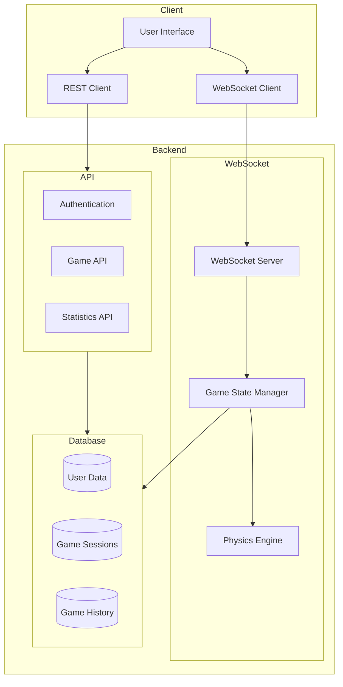
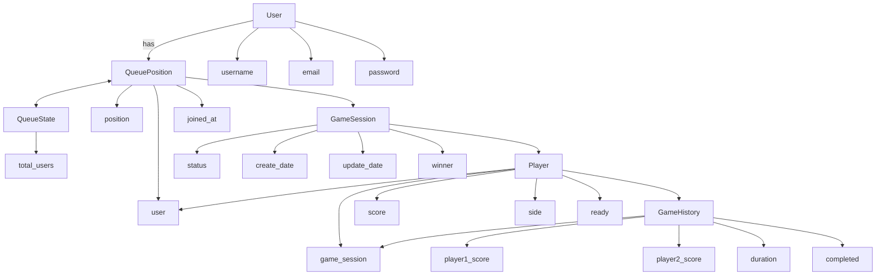

Application architecture.

## flowchart

```mermaid
flowchart TD
    subgraph Client
        UI[User Interface]
        WS[WebSocket Client]
        REST[REST Client]
    end

    subgraph Backend
        subgraph API
            Auth[Authentication]
            GameAPI[Game API]
            Stats[Statistics API]
        end

        subgraph WebSocket
            WSServer[WebSocket Server]
            GameState[Game State Manager]
            Physics[Physics Engine]
        end

        subgraph Database
            Users[(User Data)]
            Games[(Game Sessions)]
            History[(Game History)]
        end
    end

    UI --> WS
    UI --> REST
    WS --> WSServer
    REST --> API
    WSServer --> GameState
    GameState --> Physics
    API --> Database
    GameState --> Database

```

## database viusalization

```mermaid
graph TD
    User[User] -->|has| QueuePosition[QueuePosition]
    QueuePosition <--> QueueState[QueueState]
    User --> username[username]
    User --> email[email]
    User --> password[password]
    QueuePosition --> position[position]
    QueuePosition --> user[user]
    QueuePosition --> joined_at[joined_at]
    QueueState --> total_users[total_users]
    QueuePosition --> GameSession[GameSession]
    GameSession --> status[status]
    GameSession --> create_date[create_date]
    GameSession --> update_date[update_date]
    GameSession --> winner[winner]
    GameSession --> Player[Player]
    Player --> user[user]
    Player --> game_session[game_session]
    Player --> score[score]
    Player --> side[side]
    Player --> ready[ready]
    Player --> GameHistory[GameHistory]
    GameHistory --> game_session[game_session]
    GameHistory --> player1_score[player1_score]
    GameHistory --> player2_score[player2_score]
    GameHistory --> duration[duration]
    GameHistory --> completed[completed]
```

## NOTE

- make sure that every app in tha backend have migrations folder with __init__.py file.