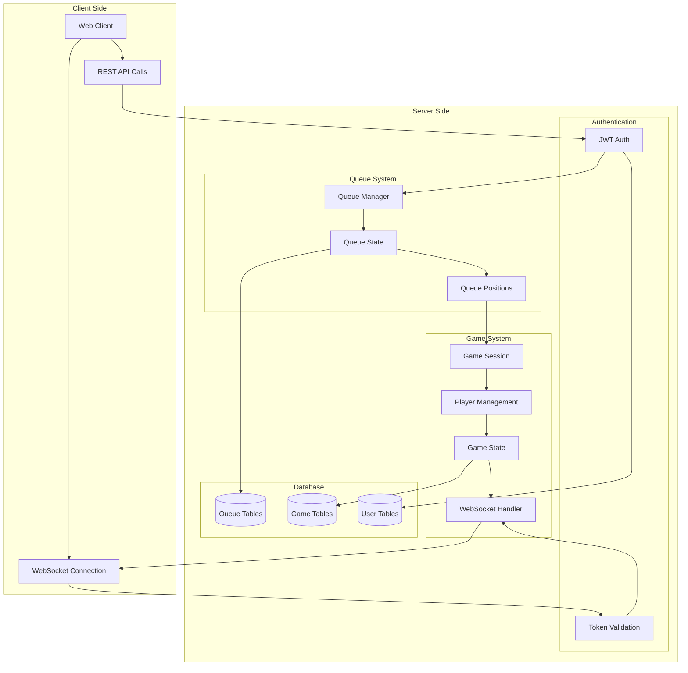
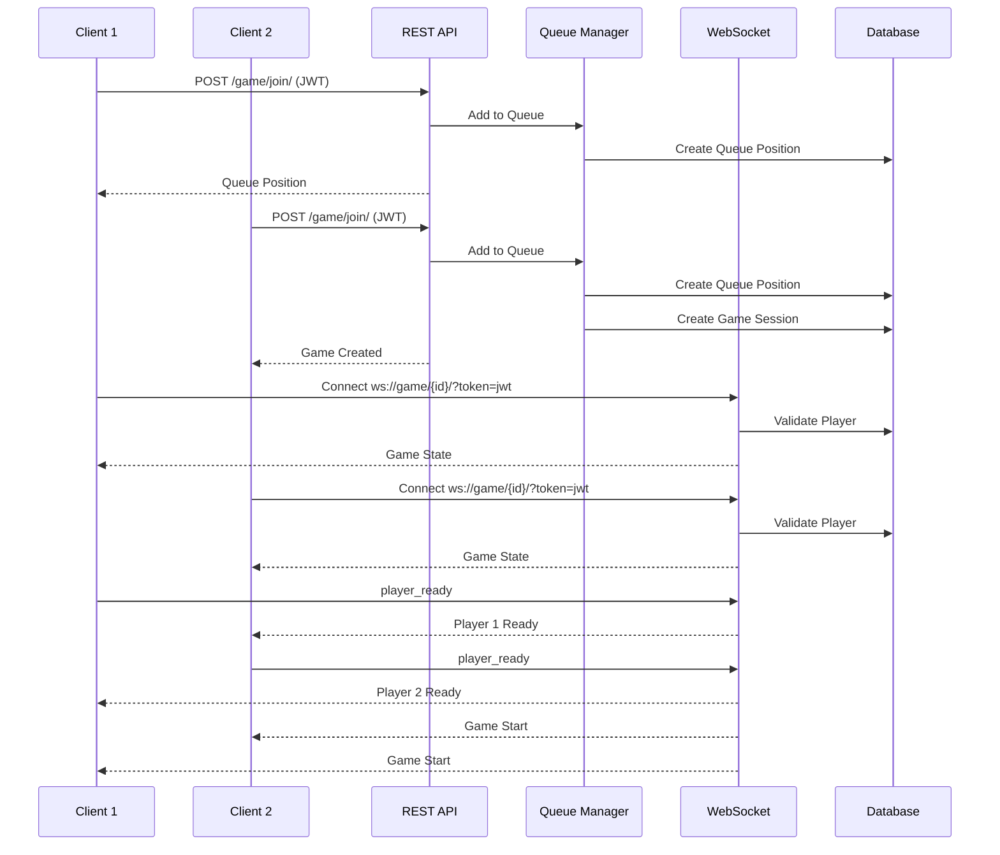
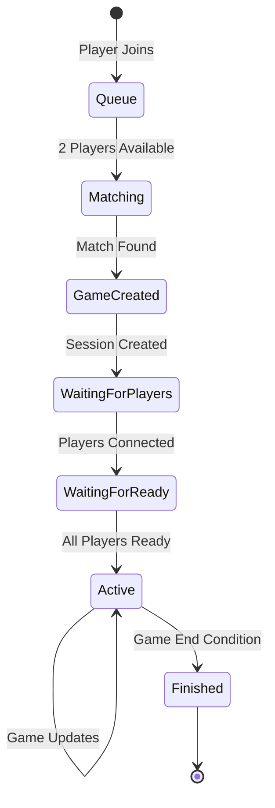

# Real-Time Multiplayer Game System

A Django-based real-time multiplayer game system with matchmaking and WebSocket communication.

## System Architecture



## Game Flow Sequence



## Game State Machine



## Features

- Real-time multiplayer gameplay
- Automated matchmaking system
- JWT authentication for secure connections
- WebSocket-based game communication
- Transaction-safe queue management
- Isolated game rooms
- Game state synchronization

## Technical Stack

- Django + Django Channels
- Redis (WebSocket backend)
- JWT Authentication
- SQLite/PostgreSQL Database

## API Endpoints

### Queue Management

```python
# Join queue
POST /game/join/
Authorization: Bearer <jwt_token>

# Leave queue
POST /game/leave/
Authorization: Bearer <jwt_token>
```

### WebSocket Events

```javascript
// Connect to game
ws://host/ws/game/{game_id}/?token=jwt_token

// Event Types:
{
    // Incoming Events
    'game_state': {
        'id': 'game_id',
        'state': 'game_status',
        'players': [{
            'id': 'user_id',
            'username': 'player_name',
            'score': 0,
            'side': 'left/right',
            'ready': false
        }]
    },
    'player_ready': {
        'user_id': 'player_id'
    },
    'game_start': {},
    'player_move': {
        'user_id': 'player_id',
        'movement': {}
    },
    'game_action': {
        'action': 'action_type',
        'data': {}
    }
}
```

## Client Integration Example

```javascript
class GameClient {
    constructor(baseUrl, token) {
        this.baseUrl = baseUrl;
        this.token = token;
        this.socket = null;
    }

    async joinQueue() {
        const response = await fetch(`${this.baseUrl}/game/join/`, {
            method: 'POST',
            headers: {
                'Authorization': `Bearer ${this.token}`
            }
        });
        return await response.json();
    }

    connectToGame(gameId) {
        this.socket = new WebSocket(
            `${this.baseUrl}/ws/game/${gameId}/?token=${this.token}`
        );

        this.socket.onmessage = (event) => {
            const data = JSON.parse(event.data);
            this.handleGameMessage(data);
        };
    }

    handleGameMessage(data) {
        switch(data.type) {
            case 'game_state':
                console.log('Game State:', data);
                break;
            case 'game_start':
                console.log('Game Starting!');
                break;
            case 'player_move':
                console.log('Player Moved:', data);
                break;
        }
    }

    sendReady() {
        this.socket.send(JSON.stringify({
            type: 'player_ready'
        }));
    }

    sendMove(movement) {
        this.socket.send(JSON.stringify({
            type: 'player_move',
            movement: movement
        }));
    }
}
```

## Setup Instructions

1. Install Dependencies:
```bash
pip install -r requirements.txt
```

2. Configure Redis:
```python
CHANNEL_LAYERS = {
    'default': {
        'BACKEND': 'channels_redis.core.RedisChannelLayer',
        'CONFIG': {
            "hosts": [('redis', 6379)],
        },
    },
}
```

3. Run Migrations:
```bash
python manage.py migrate
```

4. Start the Development Server:
```bash
python manage.py runserver
```

## Security Considerations

1. JWT Authentication
   - All connections require valid JWT tokens
   - Tokens are validated for both REST and WebSocket connections
   - Token expiration is enforced

2. WebSocket Security
   - Connections are authenticated via middleware
   - Game sessions are isolated in separate rooms
   - Player validation for each game session

3. Data Consistency
   - Queue operations use database transactions
   - Game state updates are atomic
   - Player positions are automatically maintained

## Error Handling

The system includes comprehensive error handling for:
- Invalid authentication
- Queue operation failures
- WebSocket connection issues
- Game state inconsistencies
- Player disconnections

## Contributing

1. Fork the repository
2. Create your feature branch
3. Commit your changes
4. Push to the branch
5. Create a Pull Request

## License

[MIT License](LICENSE)