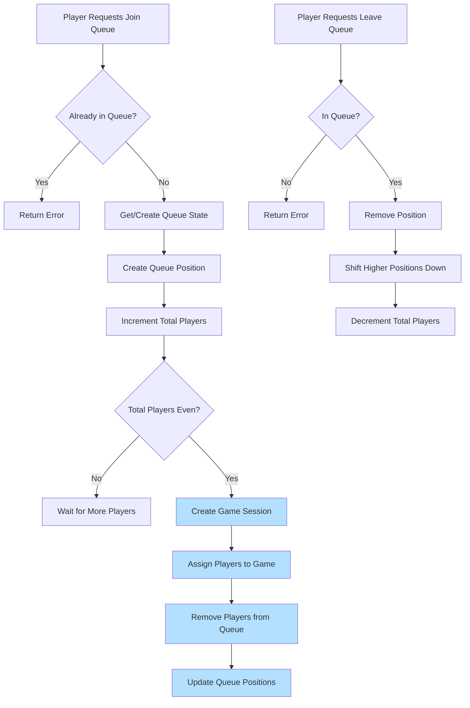

# Multiplayer Game Service

A Django backend implementing real-time multiplayer gaming with matchmaking and WebSocket communication.

## Architecture Overview

### Queue Management
- REST endpoints for queue operations (`/game/join/`, `/game/leave/`)
- Transaction-based matchmaking via `QueueManager`
- Automatic match creation when queue reaches 2 players

### Game Sessions
- Tracks game state (Pending → Active → Finished)
- Player management and scoring
- Side assignment (left/right)
- Ready-state handling before game start

### WebSocket Communication
- JWT-authenticated connections
- Real-time game state updates
- Isolated room-based communication
- Player movement and scoring events

## System Flow

### 1. Matchmaking Process
```python
# Player joins matchmaking queue
POST /game/join/

# System:
- Validates player
- Assigns queue position
- Creates match when 2 players available
```

### 2. Game Connection
```python
# Player connects to game
ws://host/ws/game/{game_id}/?token=jwt
# System:
- Validates JWT token
- Creates player connection
- Joins game room
```

### 3. Game Communication
```python
# WebSocket events:
SEND:
- player_ready
- player_move
- game_action

RECEIVE:
- game_state
- game_update
- score_update
```

## Queue Flow


## Database Structure


## Key Features
- Scalable multiplayer architecture
- Real-time bidirectional communication
- Secure WebSocket authentication
- Atomic queue operations
- Isolated game rooms
- State synchronization

## Requirements
- Django
- Django Channels
- Redis (for WebSocket backend)
- JWT Authentication
